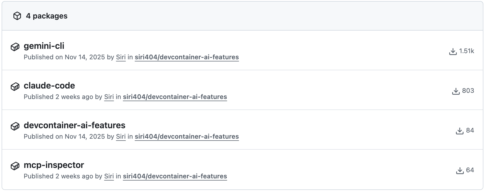

Web Software of 20+ years. Worked with giants such as Meta, Apple, Nokia, Lloyds, Bumble, Delivery Hero etc. I run [zyneai](https://zyne.digital) (previously zynedigital), and [zyne collective (fka webdeepdive.org)](https://webdeepdive.org). I am a fan of devcontainers - an open specification for enriching containers with development specific content and settings by Microsoft.
You can see and use my `devcontainer-ai-features`the [features](https://containers.dev/features?search=devcontainer%2Dai%2Dfeatures) I maintain and its usage here.
 
 

<!-- 

    

 -->
